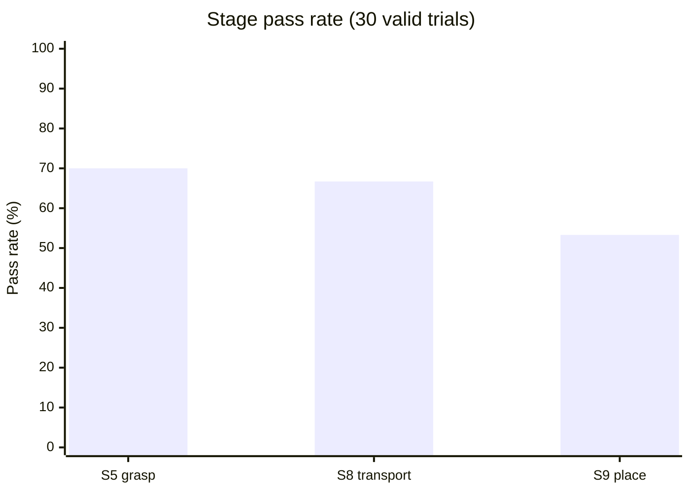
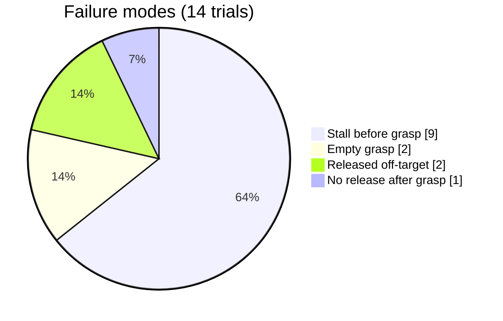
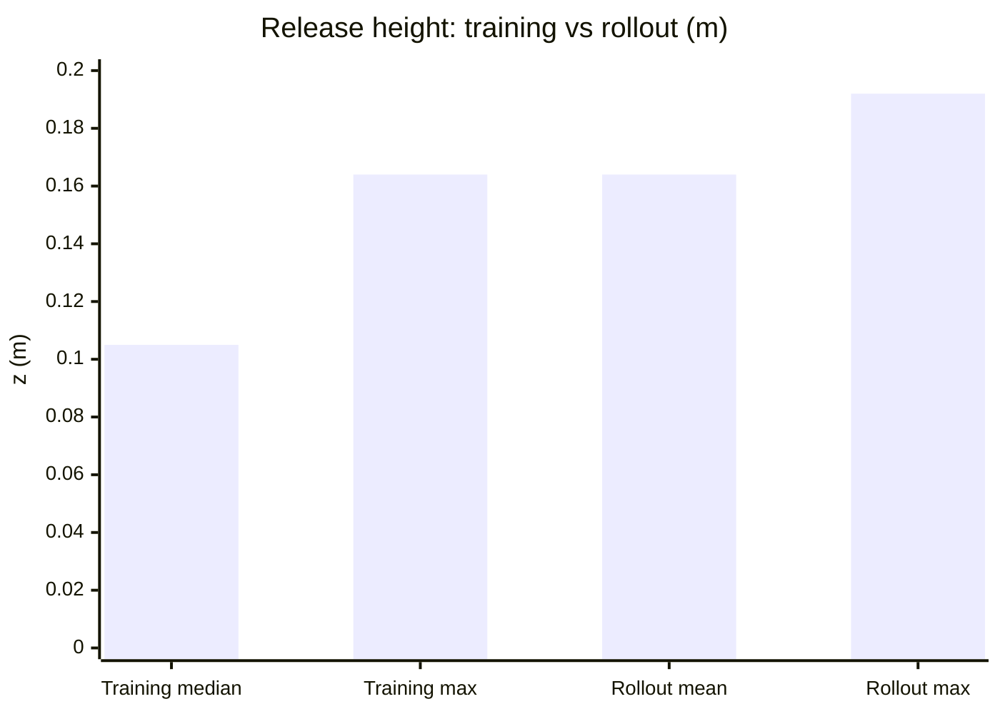

[English](RESULTS.md) | [한국어](RESULTS.ko.md)

# Evaluation — 30-Trial Success Rate

Real-robot evaluation of the 200-episode fine-tuned GR00T N1.7 policy on
Franka FR3.

```
Task6: pick up the black bowl next to the cookie box and place it on the plate
```

---

## 1. Setup

| Item | Value |
|---|---|
| Policy | GR00T N1.7 (3B), fine-tuned on 200 episodes |
| Checkpoint | `task6_v7/checkpoints/012000` |
| Dataset | `local/task6_franka_v5` (200 ep / 11,381 frames) |
| Denoising steps | 4 |
| Trials | 30 valid (1 void excluded) |
| Object layout | Varied every trial |

Rollout configuration:

```bash
YFLIP=0 GAIN=0.03 MINCMD=0.25 MIN_ERR=0.012
GAIN_HOLD=0.08 MINCMD_HOLD=0.45
GRIP_TH=0.025 GRIP_Z_MAX=0.095 GRIP_LOOK=8
GRIP_HOLD=1 GRIP_OPEN_MULT=30 GRIP_SETTLE=2.0
KEXEC=3 MAXCMD=1.0 MAXNORM=1.2 MAXSTEPS=300
STALL_N=60 STALL_MM=20
Z_FLOOR=0.070 Z_SLOW=0.16 Z_SLOW_CMD=0.08
```

Camera brightness was verified against training-data statistics
(third 163.0 / wrist 133.4) every few trials and re-tuned when it drifted.

---

## 2. Results

**Task success rate: 53.3 % (16/30)**

The baseline policy (before fine-tuning) failed at S1 — it never selected the
correct bowl.

| Stage | Sub-task | Passed | Rate |
|---|---|---|---|
| S5 | Gripper closure and stable grasp | 21/30 | **70.0 %** |
| S8 | Stable transport to plate | 20/30 | **66.7 %** |
| S9 | Alignment, descent and release | 16/30 | **53.3 %** |



### A successful trial

The arm approaching the target bowl during the grasp phase:


Immediately after release over the plate:


Successful trials took 221 steps on average (203–245), roughly 60–70 s
including the 2 s grasp settle.

---

## 3. Failure analysis

Fourteen failures break down into four modes.



### 3-1. Stall before grasp (9 trials)

All nine terminated with `stall` or `no_action` — the arm hovered near the
grasp position without emitting a CLOSE signal.

```
eval30_000  stall      192 steps
eval30_001  stall      197
eval30_002  stall      213
eval30_011  stall      220
eval30_015  no_action   30
eval30_025  stall      196
eval30_026  stall      196
eval30_029  stall      210
eval30_030  stall      201
```

The predicted gripper value (`grip_look_min`) stayed above the 0.025
threshold in these trials. The policy consistently judged that the pose was
not yet a valid grasp configuration.

**This is the single largest loss — 30 % of all trials.**

### 3-2. Empty grasp (2 trials)

`grip_width` after closure distinguishes a real grasp from an empty one.

| Trial | `grip_width` | Outcome |
|---|---|---|
| Successful trials | 0.0027 – 0.0033 | bowl held |
| `eval30_003` | **0.0002** | empty gripper |
| `eval30_024` | **0.0002** | empty gripper |

Training-data reference for a held bowl is 0.0036. A value near 0.0002 means
the fingers closed on nothing — the arm lifted before the grasp completed.

Both trials proceeded through transport and release but had nothing to place.

### 3-3. Released off-target (2 trials)

`eval30_009` (z 0.176) and `eval30_012` (z 0.192) held the bowl but released
it where it did not settle in the plate. Both are among the highest release
points recorded.

### 3-4. No release after grasp (1 trial)

`eval30_017` grasped the bowl (`grip_width` 0.0028) but never opened the
gripper, terminating with `no_action`.

---

## 4. Release height

This is the clearest systematic deviation from the demonstrations.

| | mean | min | max |
|---|---|---|---|
| Rollout (20 trials) | **0.164** | 0.132 | 0.192 |
| Training data (173 ep) | 0.105 | 0.069 | 0.164 |



**Every rollout release was above the training-data median, and 8 of 20
exceeded the training-data maximum.** The policy releases the bowl roughly
6 cm higher than the demonstrations did — effectively dropping rather than
placing it.

This does not by itself separate success from failure — successful trials
averaged 0.1634 and failed ones 0.1645. But it means **S9's defined criterion
("contact at low speed") is not met even in successful trials.** The bowl
lands in the plate by gravity, not by controlled placement.

---

## 5. Grasp position accuracy

For the 21 trials that attempted a grasp:

| | mean | min | max |
|---|---|---|---|
| Rollout `grasp_z` | 0.0792 | 0.070 | 0.086 |
| Training data | 0.0875 | 0.0618 | 0.1043 |

Grasp height falls within the training distribution, slightly toward the lower
end. **Vertical positioning is not the limiting factor** — the stalls in §3-1
are a decision problem, not a reachability problem.

---

## 6. Per-trial log

| Trial | Result | Reason | Steps | `grasp_z` | `grip_width` | `place_z` |
|---|---|---|---|---|---|---|
| eval30_000 | failure | stall | 192 | — | — | — |
| eval30_001 | failure | stall | 197 | — | — | — |
| eval30_002 | failure | stall | 213 | — | — | — |
| eval30_003 | failure | interrupt | 231 | 0.070 | **0.0002** | 0.158 |
| eval30_005 | success | interrupt | 231 | 0.077 | 0.0029 | 0.155 |
| eval30_006 | success | interrupt | 210 | 0.083 | 0.0029 | 0.154 |
| eval30_007 | success | interrupt | 244 | 0.079 | 0.0029 | 0.152 |
| eval30_008 | success | interrupt | 221 | 0.077 | 0.0031 | 0.154 |
| eval30_009 | failure | interrupt | 221 | 0.074 | 0.0031 | 0.176 |
| eval30_010 | success | error | 219 | 0.079 | 0.0030 | 0.174 |
| eval30_011 | failure | stall | 220 | — | — | — |
| eval30_012 | failure | interrupt | 241 | 0.079 | 0.0027 | **0.192** |
| eval30_013 | success | interrupt | 213 | 0.084 | 0.0028 | 0.160 |
| eval30_014 | success | interrupt | 216 | 0.082 | 0.0027 | 0.170 |
| eval30_015 | failure | no_action | 30 | — | — | — |
| eval30_016 | success | interrupt | 219 | 0.081 | 0.0028 | 0.179 |
| eval30_017 | failure | no_action | 198 | 0.078 | 0.0028 | — |
| eval30_018 | success | interrupt | 221 | 0.076 | 0.0029 | 0.161 |
| eval30_019 | success | interrupt | 206 | 0.086 | 0.0028 | 0.171 |
| eval30_020 | success | interrupt | 203 | 0.082 | 0.0029 | 0.158 |
| eval30_021 | success | interrupt | 236 | 0.074 | 0.0033 | 0.175 |
| eval30_022 | success | interrupt | 230 | 0.078 | 0.0030 | 0.182 |
| eval30_023 | success | interrupt | 245 | 0.077 | 0.0031 | 0.159 |
| eval30_024 | failure | interrupt | 204 | 0.085 | **0.0002** | 0.132 |
| eval30_025 | failure | stall | 196 | — | — | — |
| eval30_026 | failure | stall | 196 | — | — | — |
| eval30_029 | failure | stall | 210 | — | — | — |
| eval30_030 | failure | stall | 201 | — | — | — |
| eval30_031 | success | interrupt | 219 | 0.080 | 0.0030 | 0.155 |
| eval30_034 | success | interrupt | 207 | 0.082 | 0.0029 | 0.156 |

`interrupt` means the operator stopped the rollout after the bowl was
released — the task was already complete at that point.
`error` is an exception during shutdown and does not affect the outcome.
One trial (`eval30_004`) was voided due to a hardware interruption.

---

## 7. Note on experimental conditions

**Camera state proved critical.** Midway through preliminary testing the third
camera's auto-exposure had been re-enabled and its exposure reset to the
driver default, silently overriding the fixed setting. Under that condition
the grasp stage failed consistently across every trial. Restoring
`enable_auto_exposure=false` with the calibrated exposure value restored
normal behaviour immediately.

**Verify both the exposure value and the auto-exposure flag before every
evaluation session, and re-check every few trials.** A camera restart or
reconnection resets them.

```bash
ros2 param get /camera/third depth_module.enable_auto_exposure
python3 scripts/check_bright.py
```

The third camera was also physically displaced at one point, which changed the
field of view enough to break the policy entirely. Tripod position must be
preserved, or restored against a reference frame from the training data.

Both incidents produced the same visible symptom — the arm approaching the
bowl and then stalling — which is indistinguishable from a genuine policy
failure without checking the camera state first.

---

## 8. Next steps

**Grasp-stage stall (30 %) is the larger loss.** The policy reaches the
vicinity but does not commit. Offline diagnostics place the grasp-region
reproduction error at 43–48 mm against an 80 mm gripper width, so further
data scaling remains the most direct lever.

**Release height is the clearest systematic target.** Bringing it into the
training distribution (median 0.105) would satisfy S9's contact criterion and
likely improve settling stability. A height gate derived from the training
distribution was tested but interacted badly with the descent-speed limiter;
that interaction needs separating first.

**Temporal ensemble** — averaging same-timestep predictions across chunks —
could reduce output variance without retraining.
