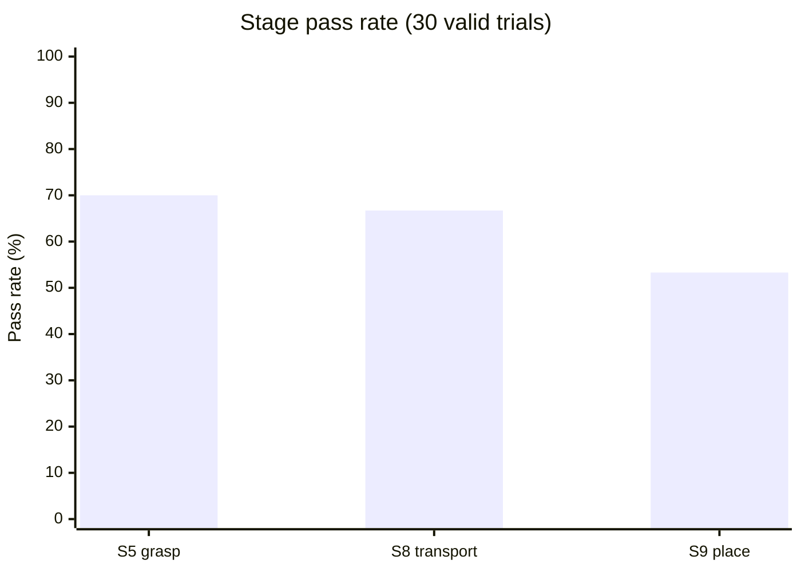
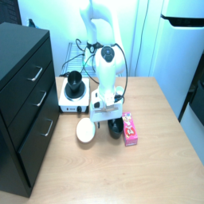
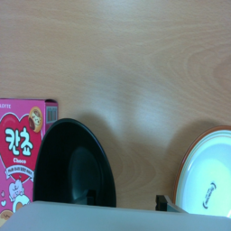
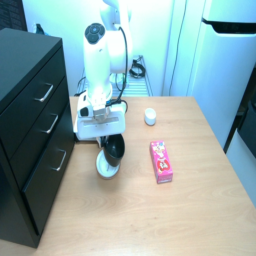
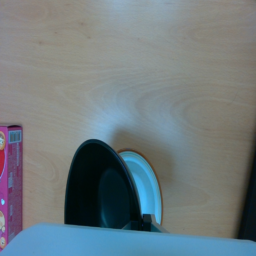
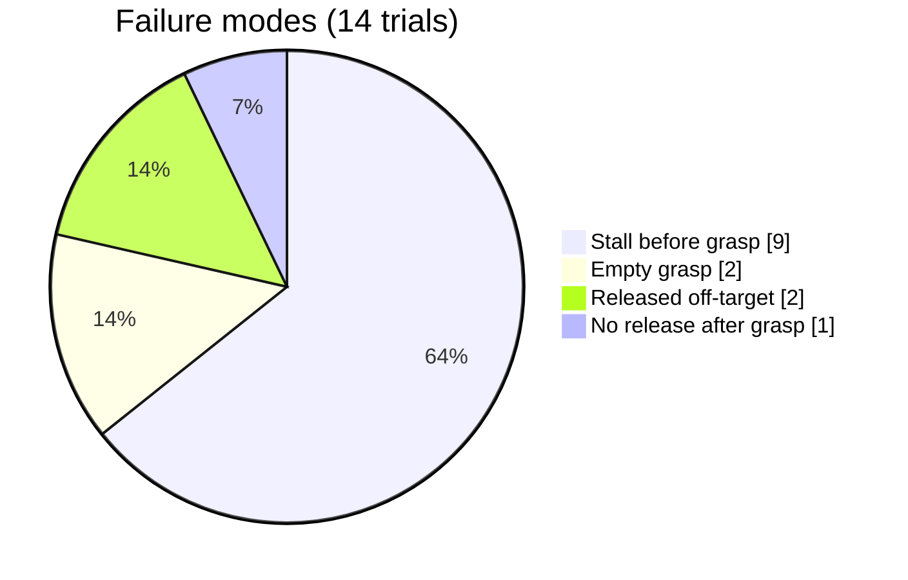
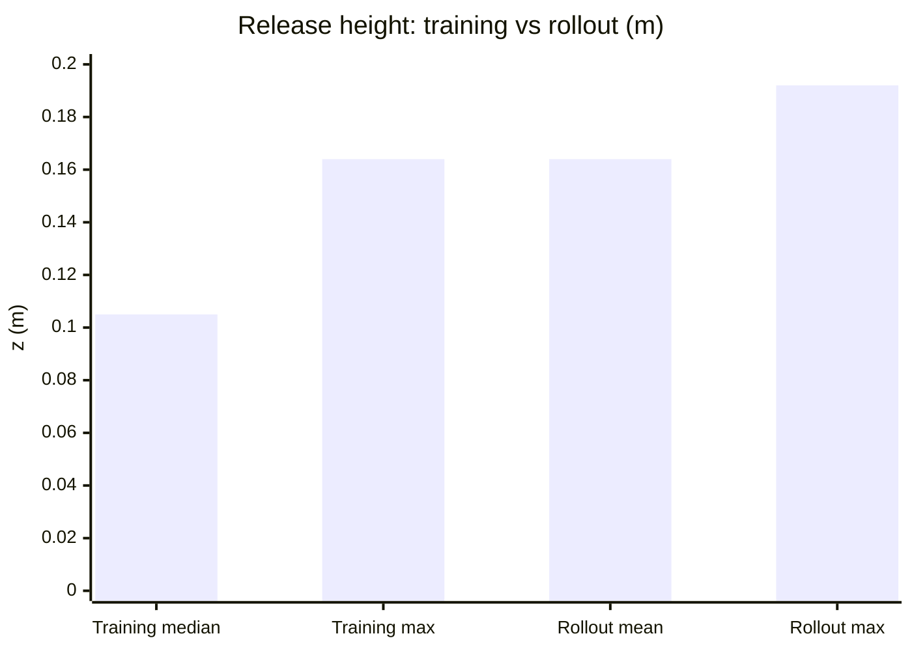

[English](RESULTS.md) | [한국어](RESULTS.ko.md)

# 평가 — 30회 성공률

200 에피소드로 파인튜닝한 GR00T N1.7 정책의 Franka FR3 실물 평가.

```
Task6: pick up the black bowl next to the cookie box and place it on the plate
```

---

## 1. 실험 조건

| 항목 | 값 |
|---|---|
| 정책 | GR00T N1.7 (3B), 200 에피소드 파인튜닝 |
| 체크포인트 | `task6_v7/checkpoints/012000` |
| 데이터셋 | `local/task6_franka_v5` (200 ep / 11,381 frames) |
| Denoising step | 4 |
| 시행 | 유효 30판 (무효 1판 제외) |
| 물체 배치 | 매 판 변경 |

롤아웃 설정:

```bash
YFLIP=0 GAIN=0.03 MINCMD=0.25 MIN_ERR=0.012
GAIN_HOLD=0.08 MINCMD_HOLD=0.45
GRIP_TH=0.025 GRIP_Z_MAX=0.095 GRIP_LOOK=8
GRIP_HOLD=1 GRIP_OPEN_MULT=30 GRIP_SETTLE=2.0
KEXEC=3 MAXCMD=1.0 MAXNORM=1.2 MAXSTEPS=300
STALL_N=60 STALL_MM=20
Z_FLOOR=0.070 Z_SLOW=0.16 Z_SLOW_CMD=0.08
```

카메라 밝기는 학습 데이터 기준(third 163.0 / wrist 133.4)과 대조해
몇 판마다 확인하고, 벗어나면 노출을 재조정했다.

---

## 2. 결과

**태스크 성공률 53.3 % (16/30)**

파인튜닝 전 baseline은 S1(목표 그릇 선택)조차 통과하지 못했다.

| 단계 | Sub-task | 통과 | 비율 |
|---|---|---|---|
| S5 | 그리퍼 폐쇄 및 안정 파지 | 21/30 | **70.0 %** |
| S8 | 접시까지 안정적으로 이송 | 20/30 | **66.7 %** |
| S9 | 접시 위 정렬 · 하강 · 해제 | 16/30 | **53.3 %** |



### 성공 시행 예시

한 성공 시행에서 두 카메라가 같은 시점에 기록한 프레임이다.

<table>
  <tr>
    <th></th>
    <th>Third 카메라</th>
    <th>Wrist 카메라</th>
  </tr>
  <tr>
    <td><b>파지</b><br>목표 그릇으로 접근</td>
    <td></td>
    <td></td>
  </tr>
  <tr>
    <td><b>배치</b><br>접시 위에서 해제한 직후</td>
    <td></td>
    <td></td>
  </tr>
</table>

wrist 시점에서 파지 순간의 목표 그릇은 쿠키 박스(왼쪽)와 접시(오른쪽) 사이에
있고, 해제 후에는 접시 위에 놓여 있다.

성공 판의 평균 소요 스텝은 221(203–245)이며, 2초 파지 대기를 포함해
약 60–70초가 걸린다.

---

## 3. 실패 분석

실패 14판은 네 가지 유형으로 나뉜다.



### 3-1. 파지 전 정체 (9판)

전부 `stall` 또는 `no_action`으로 종료됐다. 파지 위치 근처에서 맴돌기만 하고
CLOSE 신호를 내지 않았다.

```
eval30_000  stall      192 steps
eval30_001  stall      197
eval30_002  stall      213
eval30_011  stall      220
eval30_015  no_action   30
eval30_025  stall      196
eval30_026  stall      196
eval30_029  stall      210
eval30_030  stall      201
```

이 판들에서 예측 그리퍼 값(`grip_look_min`)이 임계값 0.025 위에 머물렀다.
정책이 해당 자세를 유효한 파지 자세로 판단하지 않은 것이다.

**전체 시행의 30 %로 단일 최대 손실이다.**

### 3-2. 헛잡음 (2판)

폐쇄 후 `grip_width`가 실제 파지와 헛잡음을 구분한다.

| 시행 | `grip_width` | 결과 |
|---|---|---|
| 성공 판 | 0.0027 – 0.0033 | 그릇 파지됨 |
| `eval30_003` | **0.0002** | 빈 그리퍼 |
| `eval30_024` | **0.0002** | 빈 그리퍼 |

학습 데이터에서 그릇을 잡았을 때 값은 0.0036이다. 0.0002는 핑거가 아무것도
없이 맞닿았다는 뜻으로, 파지가 완료되기 전에 들어올린 것이다.

두 판 모두 이송과 해제까지 진행했으나 놓을 물체가 없었다.

### 3-3. 접시 밖 해제 (2판)

`eval30_009`(z 0.176)와 `eval30_012`(z 0.192)는 그릇을 잡았으나 접시에
안착하지 않는 위치에서 놓았다. 기록된 해제 높이 중 가장 높은 축에 속한다.

### 3-4. 파지 후 미해제 (1판)

`eval30_017`은 그릇을 잡았으나(`grip_width` 0.0028) 그리퍼를 열지 않고
`no_action`으로 종료됐다.

---

## 4. 해제 높이

시연과의 가장 명확한 계통적 차이다.

| | mean | min | max |
|---|---|---|---|
| 롤아웃 (20판) | **0.164** | 0.132 | 0.192 |
| 학습 데이터 (173 ep) | 0.105 | 0.069 | 0.164 |



**모든 롤아웃의 해제 높이가 학습 데이터 중앙값을 넘었고, 20판 중 8판이
학습 데이터 최대치를 초과했다.** 시연보다 약 6 cm 높은 곳에서 놓으며,
사실상 내려놓기가 아니라 떨어뜨리기에 가깝다.

성공과 실패를 이 값만으로 가르지는 못한다(성공 평균 0.1634, 실패 평균
0.1645). 다만 **성공 판에서도 S9의 정의상 기준인 "낮은 속도로 접촉"은
충족되지 않는다.** 그릇이 중력으로 접시에 들어간 것이지 제어된 배치가
아니다.

---

## 5. 파지 위치 정확도

파지를 시도한 21판 기준.

| | mean | min | max |
|---|---|---|---|
| 롤아웃 `grasp_z` | 0.0792 | 0.070 | 0.086 |
| 학습 데이터 | 0.0875 | 0.0618 | 0.1043 |

파지 높이는 학습 분포 안에 있으며 약간 아래쪽에 치우친다.
**수직 위치는 제약 요인이 아니다.** 3-1의 정체는 도달 문제가 아니라
판단 문제다.

---

## 6. 시행별 기록

| 시행 | 결과 | 종료 사유 | Steps | `grasp_z` | `grip_width` | `place_z` |
|---|---|---|---|---|---|---|
| eval30_000 | 실패 | stall | 192 | — | — | — |
| eval30_001 | 실패 | stall | 197 | — | — | — |
| eval30_002 | 실패 | stall | 213 | — | — | — |
| eval30_003 | 실패 | interrupt | 231 | 0.070 | **0.0002** | 0.158 |
| eval30_005 | 성공 | interrupt | 231 | 0.077 | 0.0029 | 0.155 |
| eval30_006 | 성공 | interrupt | 210 | 0.083 | 0.0029 | 0.154 |
| eval30_007 | 성공 | interrupt | 244 | 0.079 | 0.0029 | 0.152 |
| eval30_008 | 성공 | interrupt | 221 | 0.077 | 0.0031 | 0.154 |
| eval30_009 | 실패 | interrupt | 221 | 0.074 | 0.0031 | 0.176 |
| eval30_010 | 성공 | error | 219 | 0.079 | 0.0030 | 0.174 |
| eval30_011 | 실패 | stall | 220 | — | — | — |
| eval30_012 | 실패 | interrupt | 241 | 0.079 | 0.0027 | **0.192** |
| eval30_013 | 성공 | interrupt | 213 | 0.084 | 0.0028 | 0.160 |
| eval30_014 | 성공 | interrupt | 216 | 0.082 | 0.0027 | 0.170 |
| eval30_015 | 실패 | no_action | 30 | — | — | — |
| eval30_016 | 성공 | interrupt | 219 | 0.081 | 0.0028 | 0.179 |
| eval30_017 | 실패 | no_action | 198 | 0.078 | 0.0028 | — |
| eval30_018 | 성공 | interrupt | 221 | 0.076 | 0.0029 | 0.161 |
| eval30_019 | 성공 | interrupt | 206 | 0.086 | 0.0028 | 0.171 |
| eval30_020 | 성공 | interrupt | 203 | 0.082 | 0.0029 | 0.158 |
| eval30_021 | 성공 | interrupt | 236 | 0.074 | 0.0033 | 0.175 |
| eval30_022 | 성공 | interrupt | 230 | 0.078 | 0.0030 | 0.182 |
| eval30_023 | 성공 | interrupt | 245 | 0.077 | 0.0031 | 0.159 |
| eval30_024 | 실패 | interrupt | 204 | 0.085 | **0.0002** | 0.132 |
| eval30_025 | 실패 | stall | 196 | — | — | — |
| eval30_026 | 실패 | stall | 196 | — | — | — |
| eval30_029 | 실패 | stall | 210 | — | — | — |
| eval30_030 | 실패 | stall | 201 | — | — | — |
| eval30_031 | 성공 | interrupt | 219 | 0.080 | 0.0030 | 0.155 |
| eval30_034 | 성공 | interrupt | 207 | 0.082 | 0.0029 | 0.156 |

`interrupt`는 그릇이 놓인 뒤 조작자가 롤아웃을 중단한 것으로, 그 시점에
태스크는 이미 완료된 상태다. `error`는 종료 처리 중 예외이며 결과에
영향이 없다. `eval30_004` 1판은 하드웨어 문제로 무효 처리했다.

---

## 7. 실험 조건에 관한 기록

**카메라 상태가 결정적이었다.** 예비 시험 도중 third 카메라의 auto-exposure가
다시 켜지고 노출이 드라이버 기본값으로 초기화되어, 고정 설정을 조용히
덮어썼다. 그 상태에서는 모든 시행이 파지 단계에서 실패했다.
`enable_auto_exposure=false`와 보정된 노출값을 복원하자 즉시 정상 동작이
돌아왔다.

**평가 세션 전에 노출값과 auto-exposure 플래그를 모두 확인하고, 몇 판마다
재확인해야 한다.** 카메라를 재시작하거나 재연결하면 초기화된다.

```bash
ros2 param get /camera/third depth_module.enable_auto_exposure
python3 scripts/check_bright.py
```

third 카메라가 물리적으로 이동한 적도 있었는데, 시야가 달라져 정책이
완전히 동작하지 않았다. 삼각대 위치는 유지하거나 학습 데이터의 기준
프레임과 대조해 복원해야 한다.

두 사고 모두 겉보기 증상이 같았다. 로봇이 그릇 근처까지 갔다가 멈추는
것으로, **카메라 상태를 먼저 확인하지 않으면 정책 자체의 실패와 구분되지
않는다.**

---

## 8. 다음 단계

**파지 단계 정체(30 %)가 더 큰 손실이다.** 정책이 근처까지 가지만 확신을
갖지 못한다. 오프라인 진단에서 파지 구간 재현 오차가 그리퍼 폭 80 mm에 대해
43–48 mm이므로, 추가 데이터 보강이 가장 직접적인 수단으로 남아 있다.

**해제 높이가 가장 명확한 계통적 개선 대상이다.** 학습 분포(중앙값 0.105)로
끌어내리면 S9의 접촉 기준을 충족하고 안착 안정성도 개선될 것이다.
학습 분포에서 유도한 높이 제한을 시험했으나 하강 속도 제한과 충돌해
배치 자체가 막혔다. 그 상호작용을 먼저 분리해야 한다.

**Temporal ensemble** — 여러 청크의 같은 시점 예측을 평균하는 방식 — 은
재학습 없이 출력 변동을 줄일 수 있다.
